José Antonio Quintero Maya

Grupo: DAM

1. Creamos una carpeta de trabajo con:
    - Dos carpetas (**Ordenador1** y **Ordenador2**), que simularán dos equipos remotos.
    - Este README.md para ir editándolo y creando el registro de trabajo con capturas.
    - Una carpeta "img" para las imágenes que serán referenciadas desde el README 	
	
     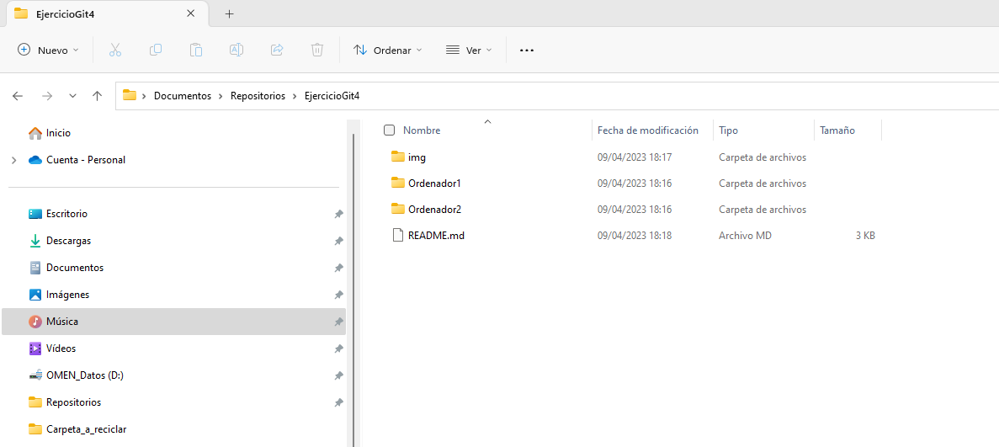
	 
2. Creamos un repositorio vacío (sin README ni gitignore) en GitHub.
	
    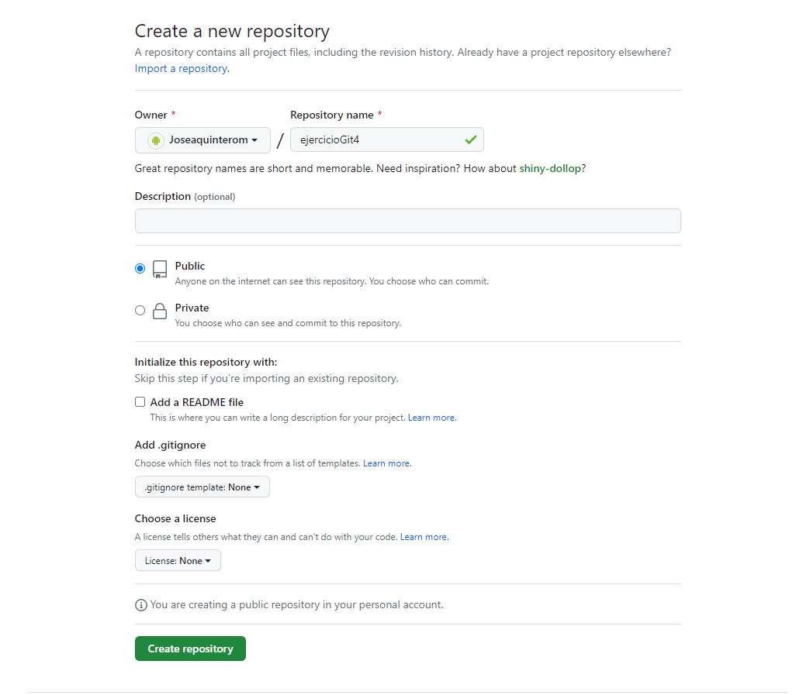
	
3. Creamos un proyecto de IntelliJ en **Ordenador1** con repositorio de Git y código de ejemplo.
	
    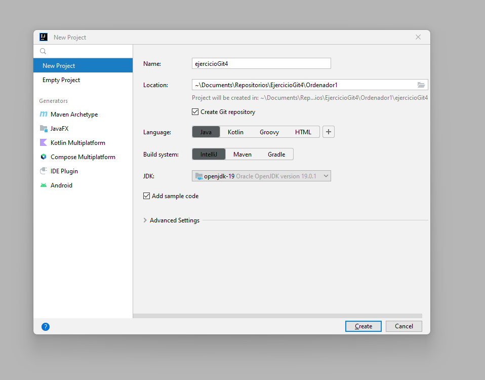
	
4. Creamos un nuevo README.md localmente (no el presente con el registro de trabajo, que se añadirá al final sustituyendo a ese.)
   
   - Creamos el **README.md** desde el proyecto en intellinj
	
   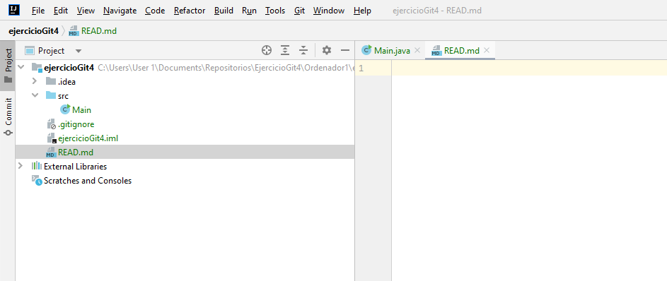
	
5. Realizamos un primer commit y push de la base del proyecto.
	 	
   - Primer commit **proyecto base con hola mundo**
	
    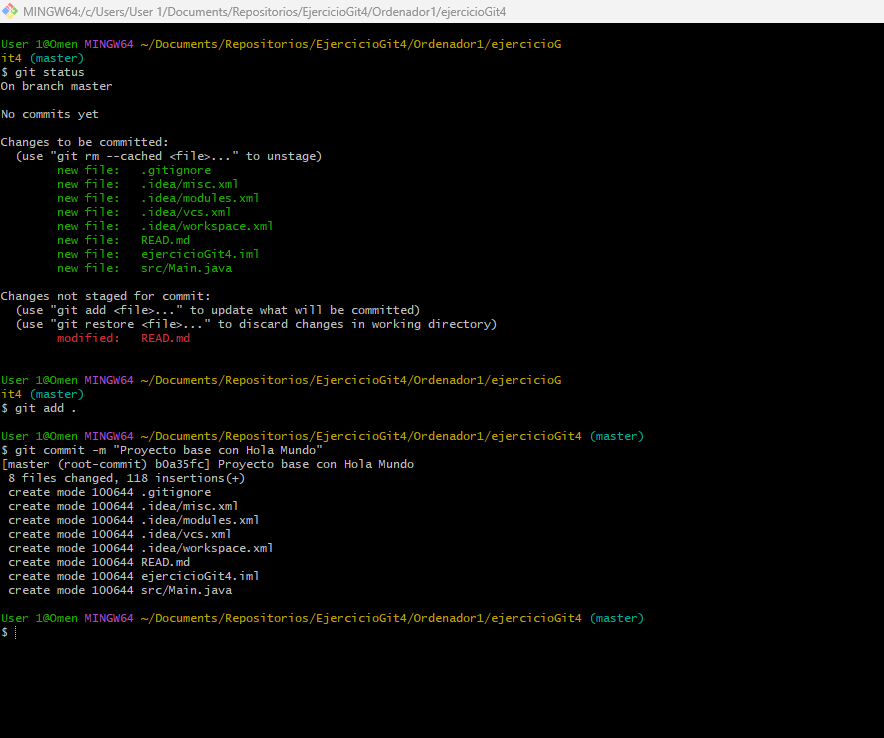
	
    git status
    git add .
    git commit -m "proyecto base hola mundo"
	
- Una vez que realizamos el **commit lo puseamos a nuestro repositorio remoto**
	  
    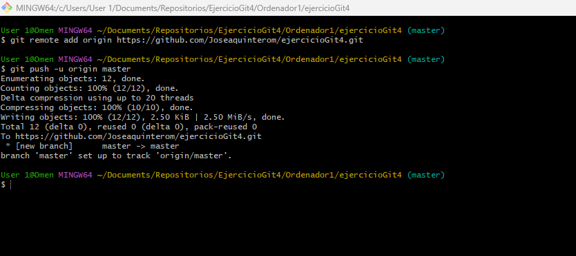
		
     git remote add origin https://github.com/Joseaquinterom/ejercicioGit4.git
     git push -u origin master
	 
6. Clonamos el proyecto dentro de **Ordenador2** y lo abrimos.
	
	(Me he cambiado a Ordenador2 y al directorio ejercicioGit4)
	
    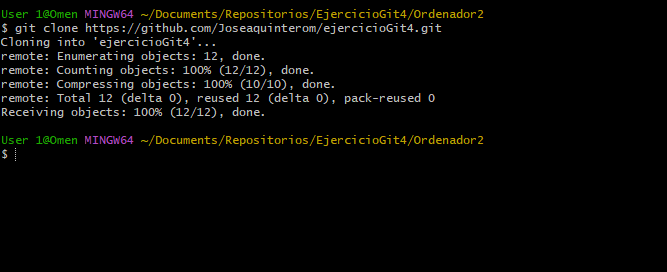
	
    git clone https://github.com/Joseaquinterom/ejercicioGit4.git
	
7. Creamos una nueva funcionalidad, para lo cual creamos una rama "feat_persona" y la desarrollamos (ver mi log de commits). Una vez lista subimos la rama (```git push feat_persona```). Después, nos movemos a master para hacer un merge de "feat_persona" **localmente**. Al no haber nuevos commits en master, el merge debería ser automático y sin conflictos. Después del merge, hacemos un push de master con los nuevos cambios añadidos.	
	
      1. Primer paso:
	  
	     - creamos la rama "feat_persona" y me cambio a ella:
	
   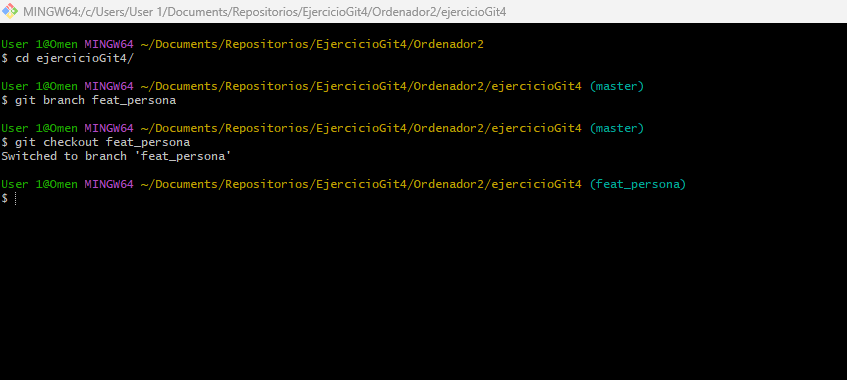
   
    git branch feat_persona
	git checkout feat_persona
	
	  2. Segundo paso:
	  
- Creamos el objeto **Persona.java**, editamos **Main.java** y lo ejecutamos
    - Realizo el segundo commit **probando un objeto Persona**	
	
     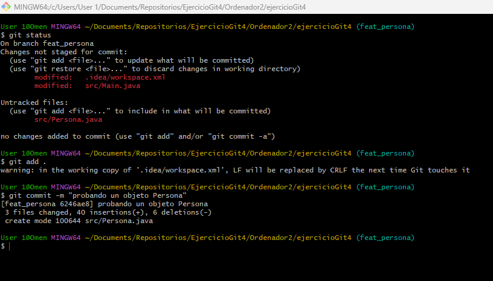
	
     git status
     git add .
     git commit -m "probando un objeto Persona"
	 
- Nos queda subir la rama feat_persona
    
    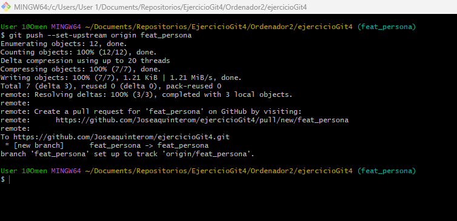
		
    git push --set-upstream origin feat_persona
	
	      3. Tercer paso
    
    - Nos cambiamos a la rama **master**, hacemos un **merge** 
	  
     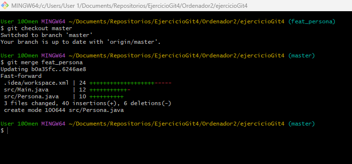
		
     git checkout master
     git merge feat_persona
	 
	  - Ahora nos queda hacer un push, para subirlo a remoto
	 
     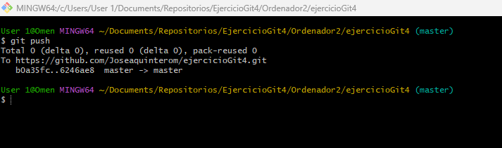

    git push
	
	8. Volvemos a **Ordenador1**. Recordamos el estado de nuestro proyecto en este ordenador haciendo un ```git status``` y un ```git log```. Si no nos indica que el master local está por detrás del remoto (origin/master), será necesario hacer un ```git fetch```.
	
    1. primer paso
  
  - Nos volvemos al directorio ordenador1
	
   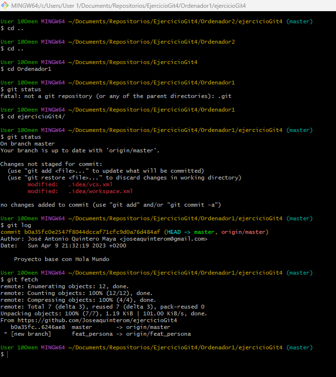
	
    git status
    git log - para ver los commits en la rama correspondiente
    git fetch - Para comprobar los cambios realizados
	
	9. Para poder seguir trabajando desde **Ordenador1**, deberíamos hacer antes de nada un pull para traernos el nuevo commit que tiene master en remoto. Sin embargo, vamos a probar qué sucedería si nos olvidamos de ello.
 
 - Este paso nos lo saltamos y no realizamos ningún cambio.
 
 10. Desarrollamos una nueva funcionalidad "feat_empleado" en su correspondiente rama.
	
    1. Primer paso
	
   - Creamos la rama **feat_empleado** y nos cambiamos a rama **feat_empleado**
	
   
	
   git branch feat_empleado o git checkout -b feat_empleado
   git checkout feat_empleado 
   
    1. Durante el desarrollo, antes de hacer el primer commit en feat_empleado, detectamos que el fichero .idea/workspace.xml cambia automáticamente a menudo al abrir el proyecto en IntelliJ (es un archivo de metadatos de proyecto de IntelliJ).
	
   2. Segundo paso
  
 - Editamos .gitignore y añadimos .idea/workspace - para que suba en remoto los cambios echos por cada cambio que hagamos
		
 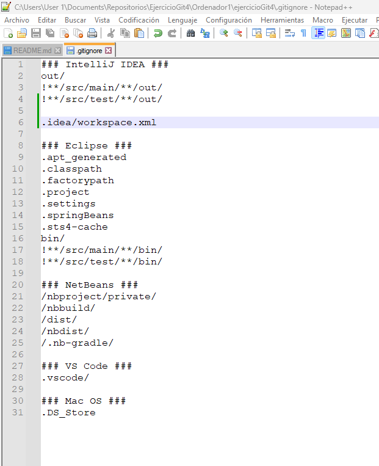
 
  2. Hacemos un primer commit para añadir ```.idea/workspace.xml``` al .gitignore. Además, como los ficheros de ese directorio ya se han añadido previamente al repositorio, tendremos que eliminarlos de él haciendo:
		
 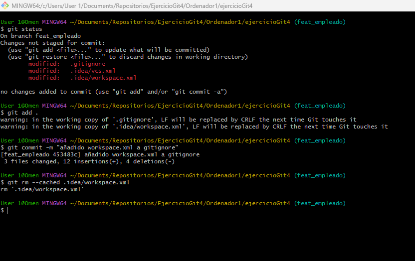
		
		
	git status
	git add .
	git commit -m "añadido workspace.xml a gitignore"
	git rm --cached .idea/workspace.xml
    
  Tercer paso
   
   - Creamos el objeto **Empleado.java** y editar el **Main.java**
   - Nos queda añadir el commit **probando objeto empleado**
	
   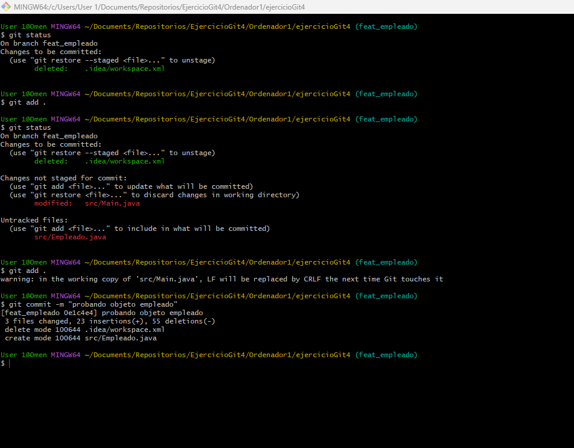

   git status
   git add .
   git commit -m "probando objeto empleado"
   
   Volvemos a Editar **Empleado.java** y **Main.java**
  - Nos queda añadir el commit **encapsulando toString de Empleado**
	
  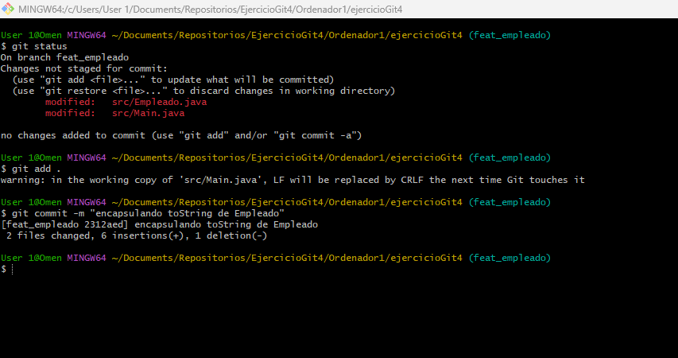
		
   git status
   git add .
   git commit -m "encapsulando toString de Empleado"
   
   - Último nos queda subir la rama correspondiente **feat_empleado**
	 
   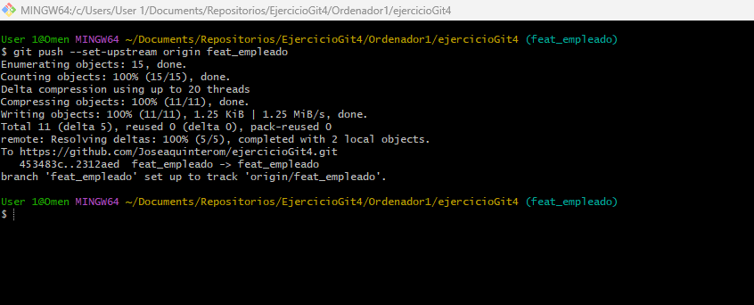
		
   git push --set-upstream origin feat_empleado
   
        - Vemos todas las ramas que tenemos.
	
   

    git branch -a
	
	feat_persona solo debería estar en remoto, ya que es una rama que no se ha usado en este "ordenador".
	
	- Hacemos un checkout a master para mergear. Al hacer el push detectamos que hay un conflicto. Hemos olvidado de descargarnos los cambios que habíamos hecho en el otro ordenador y que tenemos subidos a GitHub.
		
- Nos cambiamos a la rama master y hacemos un push "Nos da error porque no hicimos un pull para descargar los cambios en remoto a local, ahora tenemos conflicto con los nuevos cambios"

   
		
   git checkout master
   git push
   
   6. Podríamos hacer un pull, que implicaría un merge de la rama remota a la rama local, como ya hemos visto, pero para hacerlo bien, vamos a eliminar los nuevos  commits de master (siguen en feat_empleado, así que no se pierden). Para ello, usamos un ```git reset --hard``` desde master, volviendo al último commit común al  master remoto.
  
  
		
   git reset --hard
   
    7. Ahora sí podemos hacer un pull de master sin conflicto.
    
   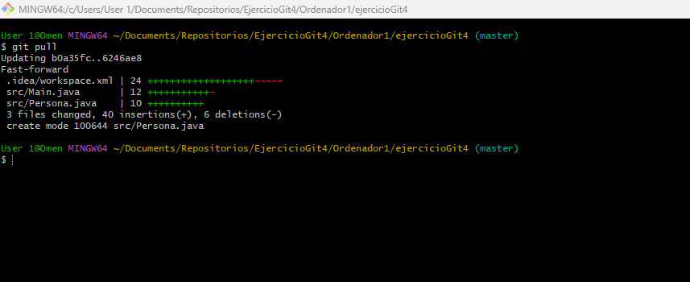
	
   git pull
   
   8. Hacemos merge de la nueva rama local feat_empleado. Ahora sí tendremos conflicto.

  

Solventamos los conflictos (en Main.java) y como realmente se está abordando la misma funcionalidad, lo llevamos más allá y dejamos una versión funcional con lo que queremos quedarnos de cada rama (ver en mi log).
		
- Da conflicto en el Main
			
  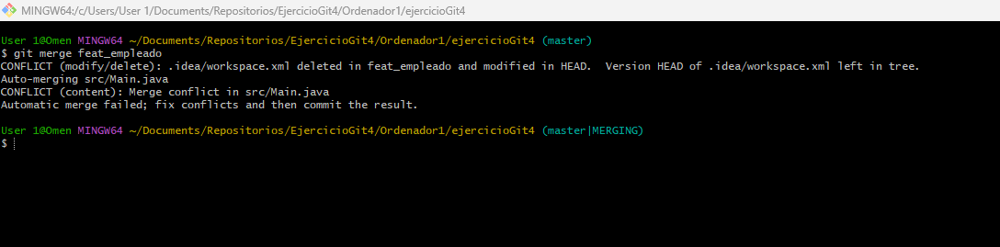
		
   git merge feat_empleado
   
   9. Terminamos el merge con add y commit, y hacemos un push.
		
    - Editamos el Main.java y solventamos los confictos, añadimos el commit **Merge remote-tracking branch 'origin/feat_empleado'** y lo psueamos 
    
    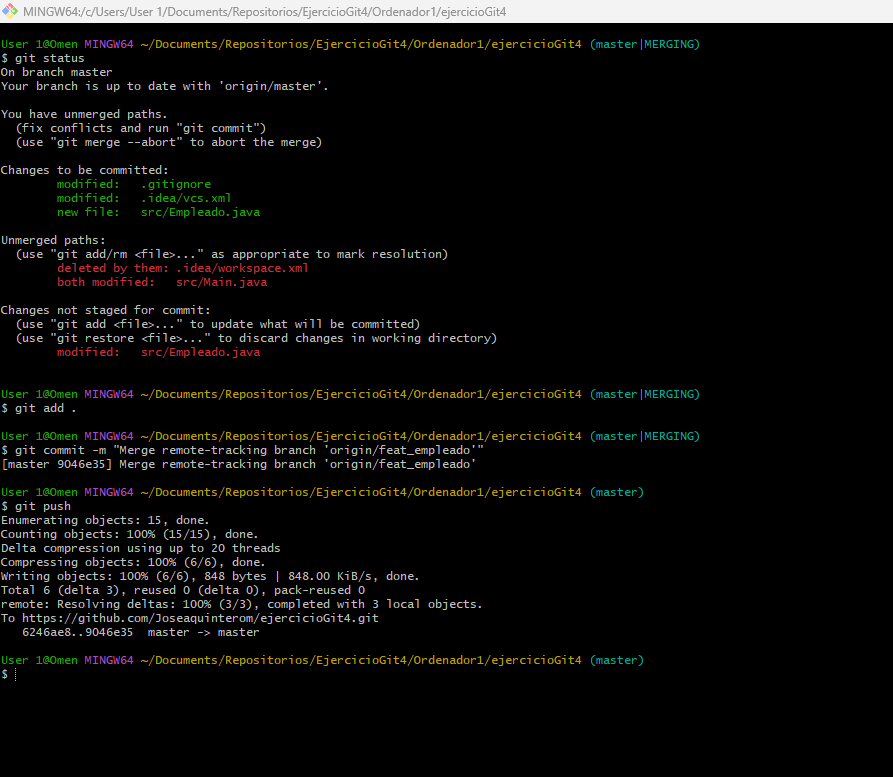
				
    git status
    git add .
    git commit -m "Merge remote-tracking branch 'origin/feat_empleado'"
    git push
	
	   
11. Volvemos a Ordenador2 y comprobamos si tenemos todo al día con ```git status``` y ```git log```. Si no nos indica que el master local está por detrás del remoto, será necesario hacer un ```git fetch```, que ahora nos indicará que debemos hacer un pull.

 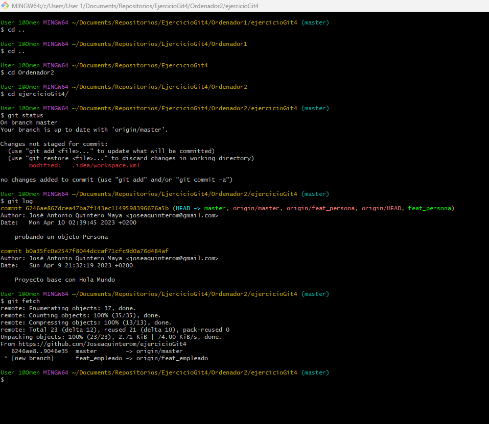
			
   git status
   git log
   git fetch
   
   - Conprobamos que hay un conflicto al intentar hacer un **git pull**, para descargar los cambios de remoto a local
 
 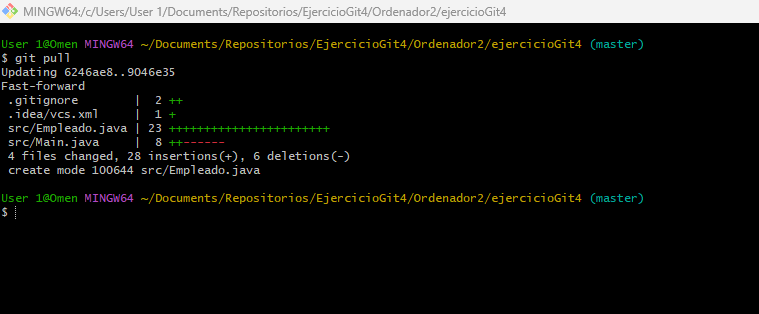
		
  git pull
  
  - Lo solucionamos haciendo un **git reset --hard** (Con esto vVuelve al último commit)
		
   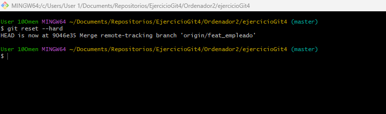
		
 git reset --hard
 
 - Ahora si nos deja hacer **git pull**
  
  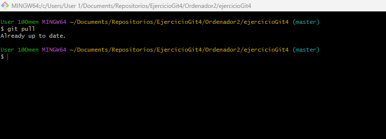
  
 git pull
 
 12. Ahora vamos a simular cómo se desarrollaría en paralelo en varias ramas (distintas personas). No crearemos carpetas que simulen ordenadores pero cada rama representará el trabajo independiente de cada componente del equipo de trabajo.

   1. Creamos dos ramas desde master, que desarrollaremos sin hacer merge a master (simulando otro desarrollador trabajando en paralelo): 
   
"feat_inmutable_fields" para evitar que se pueda cambiar el nombre y la fecha de contratación de un empleado (asumimos que las especificaciones del proyecto lo impiden, sea o no razonable).

   a. Creo las dos ramas **feat_inmutable_fields** y **bug_edad_negativa**
    
   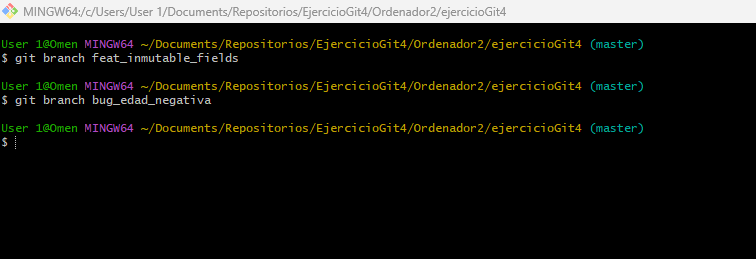
				
  git branch feat_inmutable_fields
  git branch bug_edad_negativa
  
    - Me cambio de rama **feat_inmutable_fields**
		
  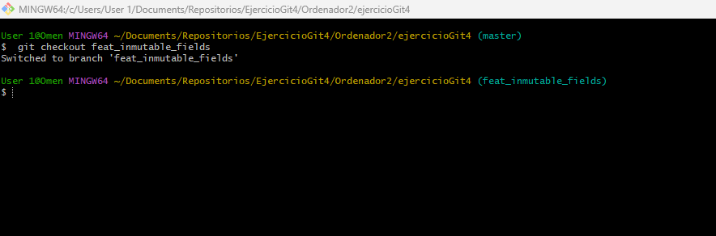
		
   git checkout feat_inmutable_fields
   
   Edito el Main.java
  - Hago el commit **diseñamos las pruebas de esta funcionalidad**
   
   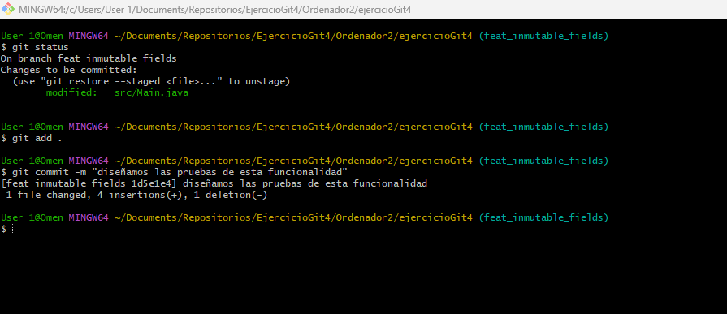
		
   git status
   git add .
   git commit "diseñamos las pruebas de esta funcionalidad"
  
   - Edito **Empleado.java** y **Main.java**
   - Añado el commit **ahora hay dos campos inmutables**
   
   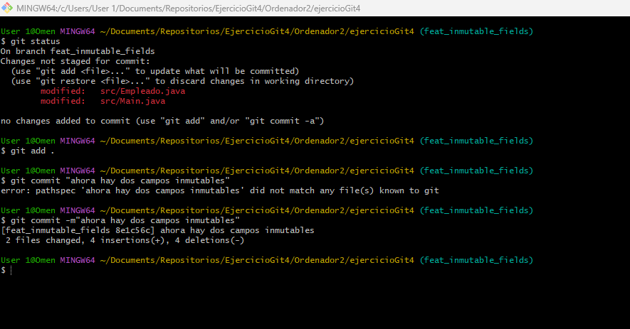
		
   git status
   git add .
   git commit "ahora hay dos campos inmutables"
  
   - Ahora subo la rama a remoto
     
   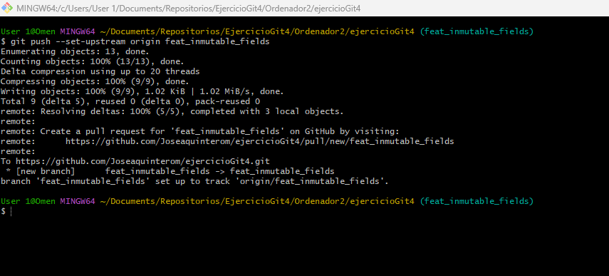
			
   git push --set-upstream origin feat_inmutable_fields
   
   "bug_edad_negativa", para garantizar que la edad de un empleado no pueda ser negativa.
   
      - Para realizar esta segunda parte del punto 12 me cambio a la **bug_edad_negativa**
	 
   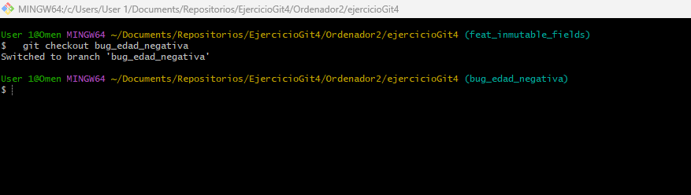
			
  git checkout bug_edad_negativa
    
  - Edito el Main.java para mostar una prueba de error y lo comiteo
    
   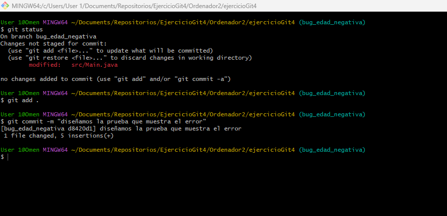
			
   git status
   git add .
   git commit -m "diseñamos la prueba que muestra el error"
         
   - Ahora edito el Main.java, Empleado.java y lo commiteo 
    
   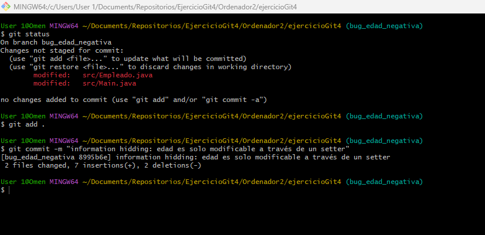		

   git status
   git add .
   git commit -m "information hidding: edad es solo modificable a través de un setter"
      
  - En el siguiente paso edito el Main.java, Empleado.java y lo commiteo
     
   
			
   git status
   git add .
   git commit -m "resuelto"
   
   - Lo que realizo ahora es un push para subirlo a remoto
  
  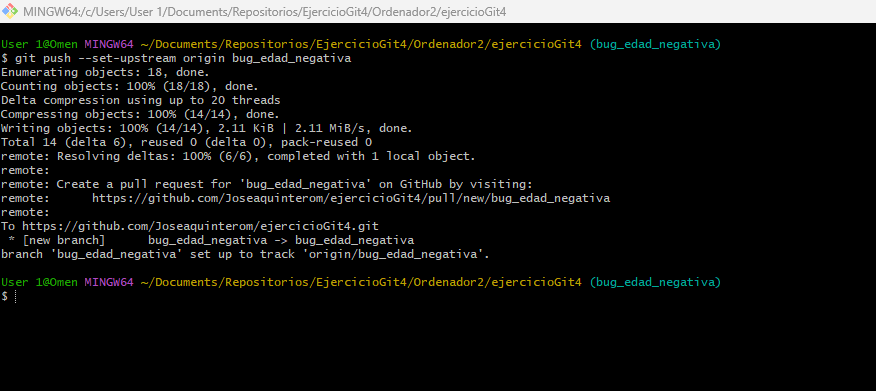
				
 git push --set-upstream origin bug_edad_negativa
 
- Una vez desarrolladas, hacemos el merge de ambas ramas a master solventando conflictos.
		
	a. Nos cambiamos a la rama master
	b. Hacemos un merge con **feat_inmutable_fields**
	c. Hacemos un push 
	
 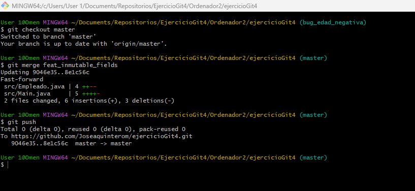
			
 git checkout master
 git merge feat_inmutable_fields
 git push
 
  d. Hacemos un merge con **bug_edad_negativa**
  
  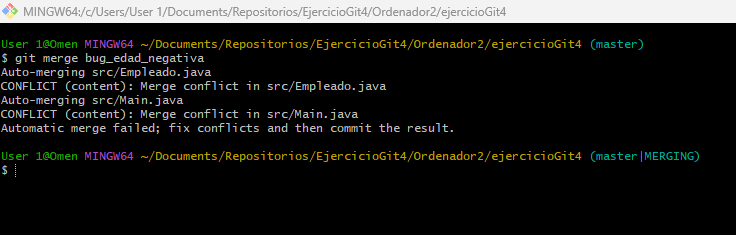
				
 git merge bug_edad_negativa
 
  e. Comprobamos que tenemos un conficto al hacer merge, nos toca solucionarlo. Editamos **Main.java**, **Empleado.java** y lo comiteamos
  
  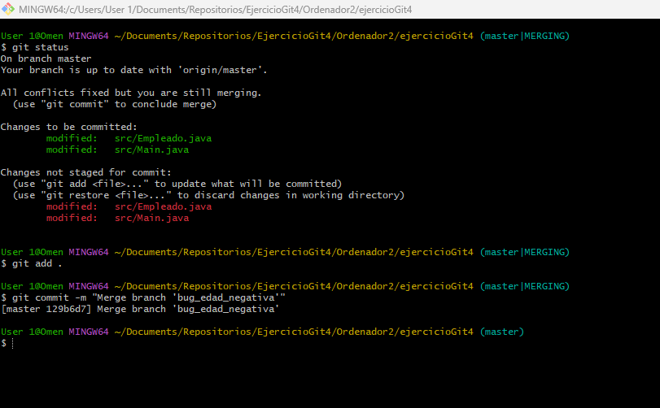
				
   git status
   git add .
   git commit -m "Merge branch 'bug_edad_negativa'"
   
   - Ahora realizo un push para subirlo a remoto:
   
   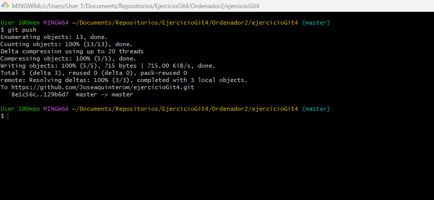
   
   git push
   
   13. Realizamos otras mejoras en la rama feat_pojo para **mostar el problema**, **los campos son privados y se accede mediante getters**, y los mergeamos.
   
   a. Creo la rama **feat_pojo** y nos cambiamos a esta rama
  
  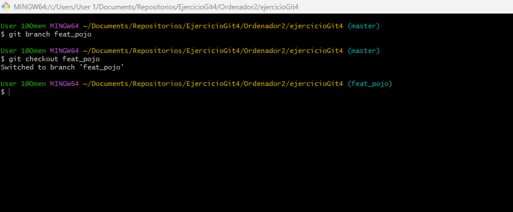
 
  git branch feat_pojo
  git checkout feat_pojo
  
   b. Modifico **Main.java** y hago el commit
  
  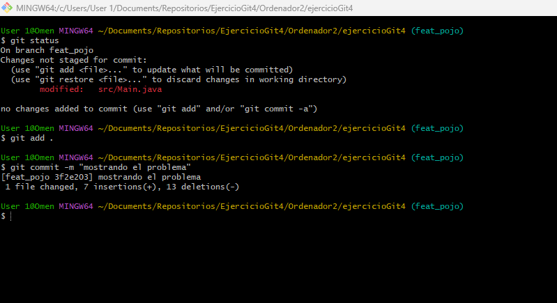
		
  git status
  git add .
  git commit -m "mostrando el problema"
  
  c. Modifico **Main.java**, **Empleado.Java** y hago el commit
  (los campos ahora son privados y se acceden mediante getters)
   
   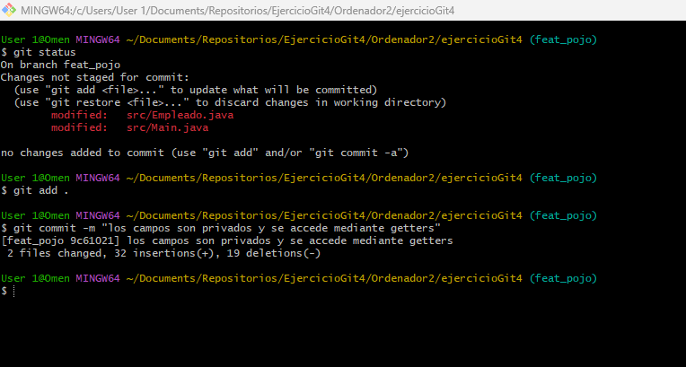
		
   git status
   git add .
   git commit -m "los campos son privados y se accede mediante getters"
   
   - Realizo un push para que se suba a remoto:
   
   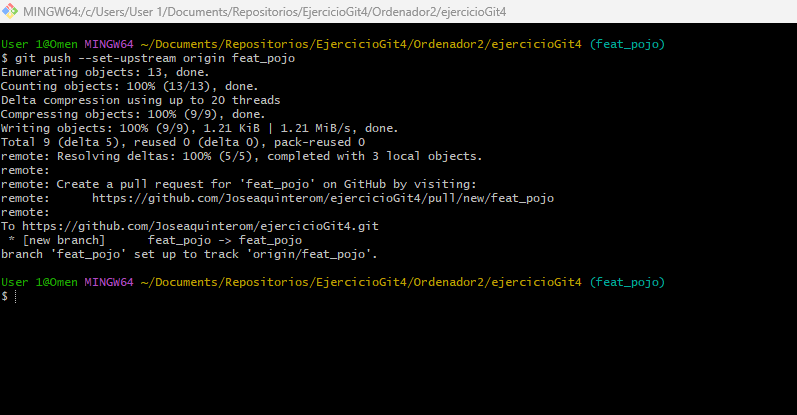
		
   git push --set-upstream origin feat_pojo
   
   - Me cambio a la rama Master, mergeo y realizo push:
  
  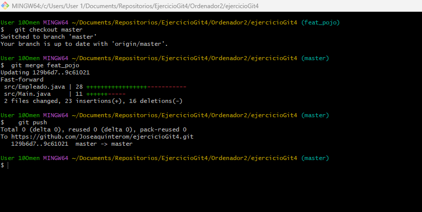
		
   git checkout master
   git merge feat_pojo
   git push
   
   Realizo otras mejoras en la rama **bug_deprecated_data_type** para solucionar los problemas de la librería obsoleta java.util.Date, y los mergeamos.
   
   - a. Creo la rama bug_deprecated_data_type y me cambio a ella:
  
  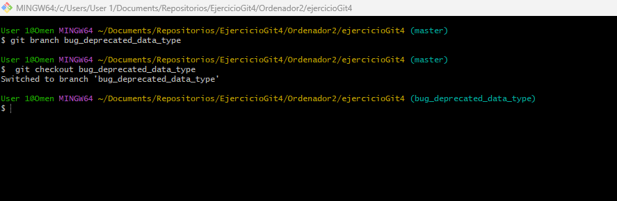
		
  git branch bug_deprecated_data_type
  git checkout bug_deprecated_data_type
  
   - b. Modifico **Main.java** y realizo el commit:
   
   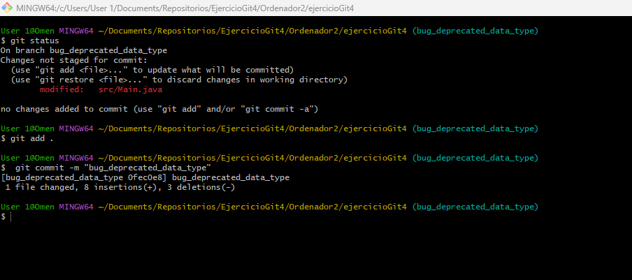
			
   git status
   git add .
   git commit -m "bug_deprecated_data_type"
      
   - c. Modifico **Main.java**, **Empleado.Java** y lo comiteo:
  
  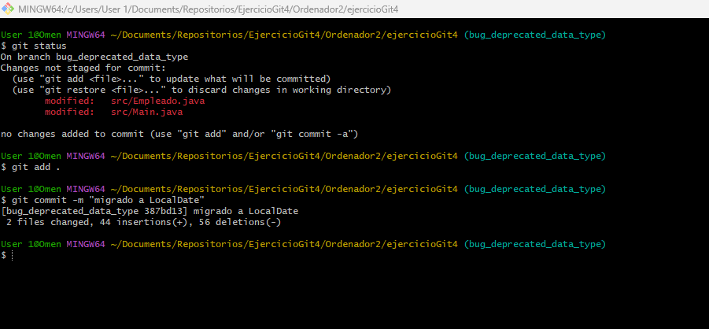
			
  git status
  git add .
  git commit -m "migrado a LocalDate"
  
  - Subo a remoto esta rama:
  
  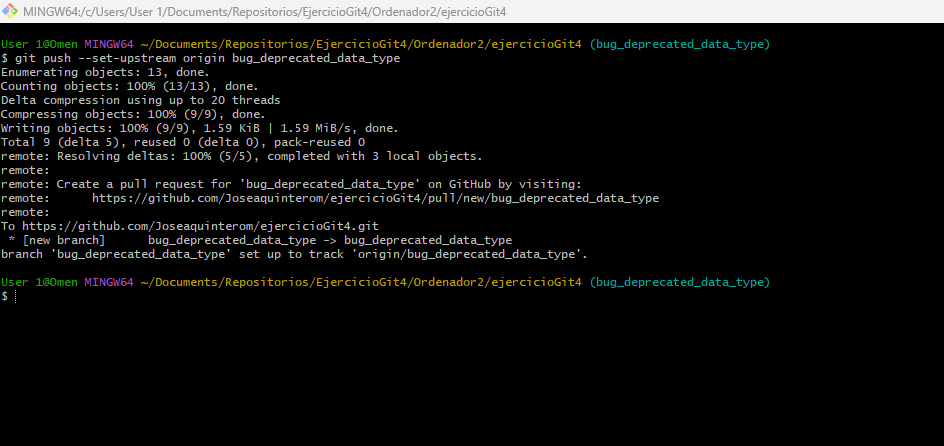
			
   git push --set-upstream origin bug_deprecated_data_type
   
  - Ahora me cambio a la rama Master, lo mergeo y realizo el push:
  
  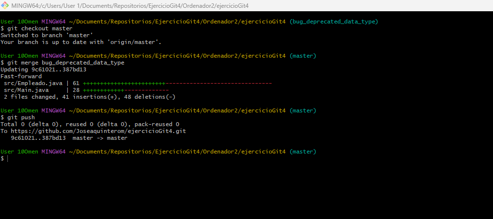
			
  git checkout master
  
  git merge bug_deprecated_data_type
  
  git push